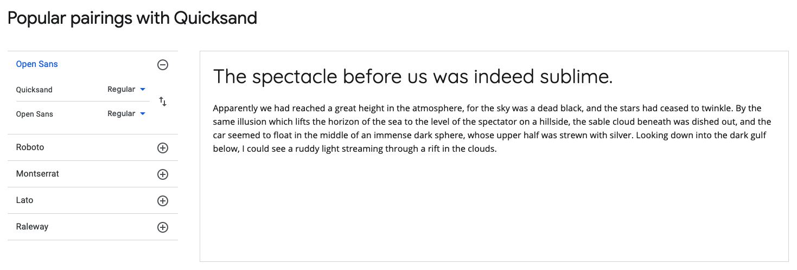
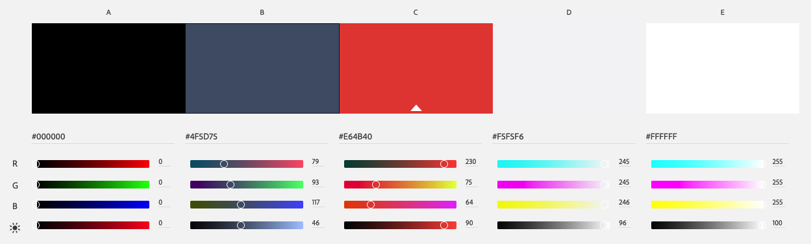

# Forum

## Project 2 for CS5610 Web Development

https://johnguerra.co/classes/webDevelopment_fall_2020/  

## Authors: 
* Emile Ferrand
* David Pan

## Project Objectives: 
### Create an internet forum with following features: 
* User can view previous posts and add comments to it
* To comment or create post, a user needs to create a profile (and login)
* Search functionality based on tags
* Show a user map with some forum stats

## Instructions to Build: 

* Clone the repository.
* Navigate to repository folder in command line.
* Run npm install to install dependencies. 
* In command line type 'npm start:all' to start both the backend as well as frontend react. 
****You may want to add some more information here this didnot work for me. ****
	* For only backend: 'npm run backend'
	* For only frontend: 'npm run start-react'
* In your web browser go to localhost:8080 to visit the forum. (3000 for backend)

### Project 2 last commit:
* hash: d5b2032aebb24808930d756519730e1c04a58e19
* url: https://github.com/emile-f/forum/tree/d5b2032aebb24808930d756519730e1c04a58e19

### Project 3 fonts:
* All Headings and menu's: Quicksand
* All other content: Open Sans

We found the font pairing under google fonts "Popular pairings with Quicksand".
Google fonts page: https://fonts.google.com/specimen/Quicksand?query=quick#standard-styles

### Project 3 colors:
* Main text color: #000000
* Main accent color: #4f5d75
* Error message color: #e64b40
* Background color: #F5F5F6
* cards color: #FFFFFF

## Example screenshots: 

* The create thread page: 

* The Thread and replies page: 

* The world map page: 

## License

> You can check out the full license [here](/LICENSE)

This project is licensed under the terms of the **MIT** license.
